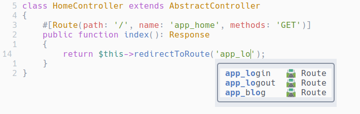

# cmp-symfony-routes

[nvim-cmp](https://github.com/hrsh7th/nvim-cmp) source for symfony routes.  
The source is using file `./var/cache/dev/url_generating_routes.php`.

This is plugin in a very simple implementation, the autocomplete won't work
if the above file doesn't exist.



## Setup

```lua
require('cmp').setup({
  sources = {
    { name = 'symfony_routes' },
  },
})
```

## Triggers

The plugin is activated for `php` and `twig` filetypes.  
The trigger character is a single quote, and the line must contains
`route`, `path` or `url`. This covers most of Symfony and twig
functions used to generate URLs:
- PHP
  - redirectToRoute
  - $router->generate
- Twig
  - path
  - url

## Configuration

There is no configuration at the moment.

## Todo

- Refresh routes every 10 seconds
- Configure filetypes
- Configure input file
